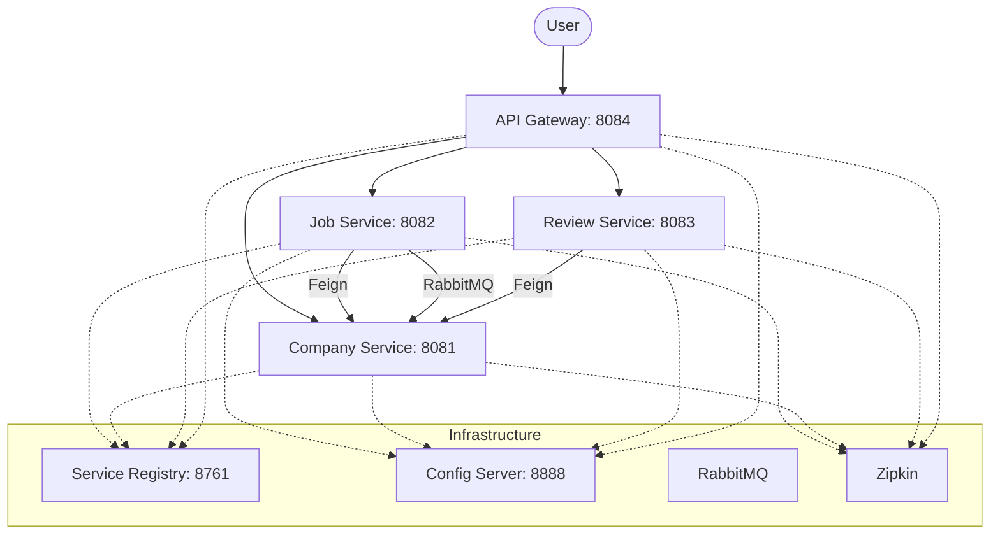

# Job Portal Microservices

A robust, scalable Job Portal application built using a microservices architecture with Spring Boot and Spring Cloud. This project demonstrates inter-service communication, centralized configuration, service discovery, and distributed tracing.

## 🏗️ Architecture

The system consists of several microservices interacting through a central Gateway and discovery via Eureka.



## 🚀 Microservices Overview

| Service | Port | Description |
| :--- | :--- | :--- |
| `service-registry` | 8761 | Eureka server for service discovery. |
| `config-server` | 8888 | Centralized configuration via Git (`config-repo`). |
| `gateway` | 8084 | API Gateway for routing and security. |
| `jobms` | 8082 | Manages jobs and search functionality. |
| `companyms` | 8081 | Manages company profiles and details. |
| `reviewms` | 8083 | Handles company reviews and ratings. |

## 🛠️ Technology Stack

- **Framework**: Spring Boot 3.x / 4.x, Spring Cloud
- **Language**: Java 17
- **Database**: PostgreSQL (JPA/Hibernate)
- **Messaging**: RabbitMQ (for async updates)
- **Discovery**: Eureka Service Registry
- **Gateway**: Spring Cloud Gateway
- **Tracing**: Micrometer Tracing & Zipkin
- **Containerization**: Docker & Kubernetes (Minikube)

## 📋 Prerequisites

- JDK 17 or higher
- Maven 3.6+
- Docker & Docker Compose
- RabbitMQ
- PostgreSQL

## 🚦 Getting Started

### 1. External Services
Ensure RabbitMQ and Zipkin are running. You can use Docker:
```bash
docker run -d -p 9411:9411 openzipkin/zipkin
docker run -d -p 5672:5672 -p 15672:15672 rabbitmq:3-management
```

### 2. Infrastructure Services
Start these in order:
1. `config-server` (Port 8888)
2. `service-registry` (Port 8761)
3. `gateway` (Port 8084)

### 3. Application Services
Start the business services:
- `companyms`
- `jobms`
- `reviewms`

## 🛣️ API Endpoints (via Gateway: 8084)

### Jobs (`/jobs`)
- `GET /jobs`: Find all jobs
- `GET /jobs/{id}`: Get job details
- `POST /jobs`: Create a new job
- `PUT /jobs/{id}`: Update a job
- `DELETE /jobs/{id}`: Delete a job

### Companies (`/companies`)
- `GET /companies`: List companies
- `POST /companies`: Create a company profile

### Reviews (`/reviews`)
- `GET /reviews?companyId={id}`: Get reviews for a company
- `POST /reviews?companyId={id}`: Submit a review

## ☸️ Kubernetes
The project includes Kubernetes deployment files in the `/k8s` directory. To deploy to Minikube:
```bash
kubectl apply -f k8s/
```

## 📬 Contact
**Author**: [Saiful0640](https://github.com/Saiful0640)
